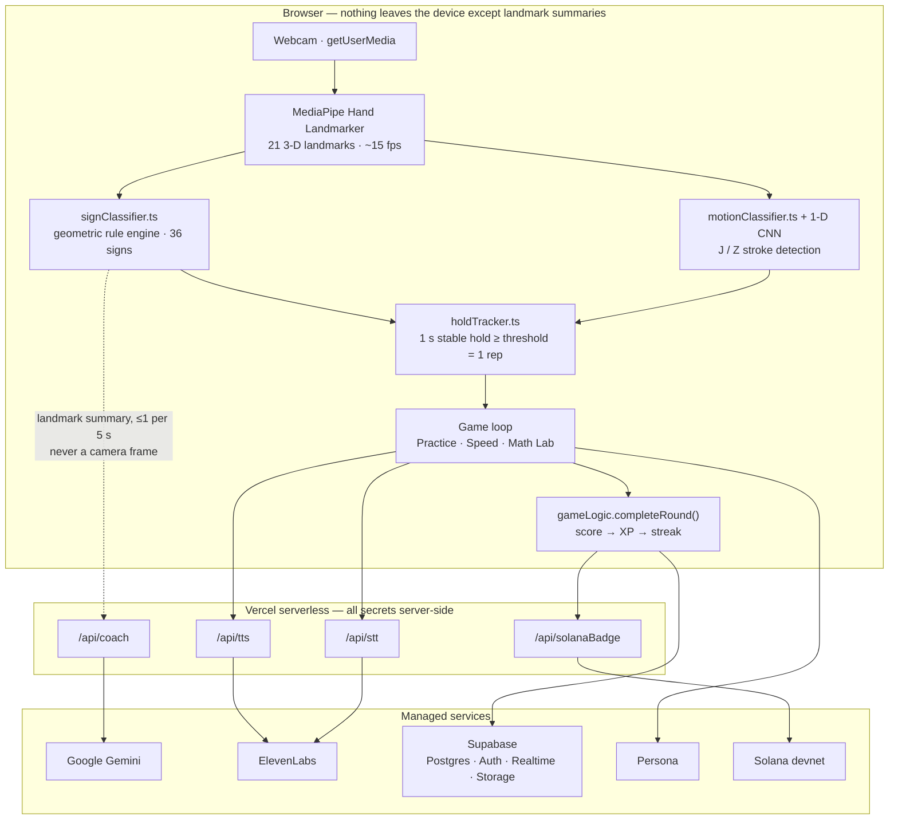

<div align="center">

# Signly

**Say it with your hands.**

A browser-based American Sign Language tutor that watches your hands through a webcam,
scores every attempt in real time, and coaches you toward a cleaner sign — with no app
install, no wearable, and no video ever leaving your device.

**[signly.vip](https://signly.vip)** · Built at HackRice '26 · Games & Gamification track

</div>

---

## The problem

Learning to sign is a motor skill, not a vocabulary list. You can memorize that the letter
`R` is two crossed fingers and still form it wrong for months, because nothing tells you
otherwise. The feedback loop that makes a language app work — *attempt, correction,
retry* — requires a fluent signer sitting across from you.

So the tools split into two disappointing halves. Dictionaries and video courses show you
the sign but never see yours. Mainstream language apps have world-class feedback loops
that are built entirely around audio, which makes them structurally unavailable to the
communities that use signed language most.

Signly closes the loop. The camera is the microphone.

---

## What it does

| Surface | What happens |
|---|---|
| **Learn** | A unit roadmap grouped by handshape family — fist shapes, open hand, pointing shapes, pinch & curl, motion letters. Units unlock in sequence. Your own name is rendered as fingerspelling tiles on first load. |
| **Practice** | A five-level course, from *Your first five* (I L V W Y) through the full 26-letter alphabet, the digits, and a mixed final level. Each prompt is a hold-to-confirm rep against the live camera. |
| **Speed** | Three timed clocks — Easy 60s ×1, Medium 30s ×1.5, Hard 15s ×2 — dealt from a shuffled 36-sign deck with no repeats across the reshuffle seam. |
| **Math Lab** | Nine games across three difficulty tiers — arithmetic, counting, comparison, times tables, sequences, fractions, algebra, logic, calculus. You answer by *signing* the digits, or by *speaking* them. Multi-digit answers are signed one digit at a time. |
| **Dictionary** | A 2,683-sign video lookup backed by Microsoft's ASL Citizen dataset. Type a word or a phrase; get the clips, with unmatched words surfaced rather than silently dropped. |
| **Leaderboard** | Live-updating XP rankings over Supabase Realtime, gated behind Persona human verification so a bot cannot farm the top slot. |

Progress is a real system, not a score counter: daily streaks on a calendar, XP with level-up
thresholds, per-level and per-game personal bests, and a Google-authenticated profile that
syncs across devices. Guests play fully offline-local with nothing written to the server.

---

## How it works



**The load-bearing decision: recognition runs entirely in the browser.** No frame, no
landmark stream, and no audio of the learner is ever sent to a server for classification.
That is not only a privacy position — it is what makes a one-second hold feel instant. A
round-trip per frame would put network latency inside the feedback loop and the whole
product would feel broken.

The cloud is used only where it is genuinely better than local: one qualitative coaching
sentence every five seconds, speech synthesis, transcription, persistence, and identity.

---

## The recognition engine

This is the hard part, so here is exactly what it is.

**Landmarks.** MediaPipe Hand Landmarker (`@mediapipe/tasks-vision@0.10.32`, pinned, loaded
from jsDelivr with matching WASM) returns 21 3-D landmarks per frame. Inference is throttled
to roughly 15 fps on the main thread. Video and overlay are mirrored for the user;
classification runs on unmirrored coordinates.

**Static handshapes.** `signClassifier.ts` scores each candidate label from measured joint
geometry — finger extension, joint straightness, thumb placement, inter-fingertip contact
distance, finger separation. The *weakest required feature* caps the score, so a shape that
barely satisfies a rule cannot earn a rep on the strength of the features it happens to nail.
Confidence is an explicit geometric match score, not a calibrated probability, and the code
says so.

**Motion letters.** `J` and `Z` are trajectories, not poses. A stable seed pose starts a
tracker; corner searches then look for a downward-and-rising hook (J) or
horizontal / down-diagonal / horizontal strokes (Z), in palm-size units so the result is
invariant to distance from the camera. On top of that sits a ~16 KB 1-D CNN
(TensorFlow.js, loaded from jsDelivr) trained on procedurally generated synthetic
trajectories **labeled by the geometric heuristic itself** — so the model can only ever
learn a smoother version of a decision boundary we had already validated, never a worse one.
The heuristic remains the automatic fallback whenever the model fails to load, errors, or
misses its own confidence floor, and `disableMotionML: true` forces pure-heuristic scoring
without a code change.

**Confirmation.** A rep requires the same label held stably for 1000 ms at or above its
threshold. Tracking gaps over 250 ms, weak or wrong guesses, and target changes all reset
accumulated evidence. Games always supply their target; recognition is not a correctness
judgment on its own.

### Honest capability tiers

Every sign carries a `CONFIDENCE_CAP` — the ceiling its score can reach. This is the single
source of truth for what the product claims:

| Tier | Cap | Signs | Meaning |
|---|---|---|---|
| **Demo** | 0.98 | `I L V W Y A S T N M` + `J Z` (motion) + digits `1–9` | Live-tested on real webcams. Confirms at the shared 0.8 threshold. Unlocked in the roadmap. |
| **Developing** | 0.50–0.65 | `B C D E F H K O P Q R U X` + `0` | Classifier rules exist and are exercised by tests, but are not yet validated on camera. Reachable in Practice and Speed at a proportionally lowered floor; never counted as validated. |

Promoting a sign after live testing is a **one-line change** to that table. Lessons, unit
locks, the roadmap, and Math's answer constraints all derive from it — nothing else in the
codebase needs to move. That is why the honest tier can stay honest under demo pressure.

---

## Sponsor technology, and why each one is load-bearing

| Technology | Where it lives | Why it is not decoration |
|---|---|---|
| **Google Gemini** | `api/coach.ts` — `gemini-3.5-flash-lite` via the Interactions API | Turns a numeric score into a *correction*. "Your ring finger is drifting up" is the thing a learner can act on, and no rule engine can phrase it. Sent a rounded landmark summary, never a frame; ≤1 request per 5 s, one in flight, 8 s timeout, recognition continues uninterrupted if it fails. |
| **ElevenLabs** | `api/tts.ts` (`eleven_turbo_v2_5`), `api/stt.ts` (`scribe_v2`) | The two-way bridge between a signed answer and a spoken one. STT is keyterm-biased to digit vocabulary and homophone-aware ("for", "to", "ate"), because a hackathon room is loud and a general dictation model is the wrong tool for a one-digit answer. |
| **Persona** | `meta/personaVerify.ts`, embedded SDK v4.11.0 | A public leaderboard with real prizes is a bot magnet. Persona is the gate between "has an account" and "is a human who may compete" — deliberately separate from Google sign-in, which only creates the account. |
| **Solana** | `api/solanaBadge.ts` — devnet SPL mint at a 3-day streak | A portable, verifiable record of a learning milestone. Implemented, isolated behind its own endpoint, and intentionally not surfaced in the shipped UI — a stretch that stayed off the critical path. |

---

## Accessibility and privacy

Accessibility is the product thesis, not a compliance pass.

- **Camera stays local.** No frame, landmark stream, or learner audio is uploaded for
  recognition. The only thing that reaches Gemini is a rounded numeric summary of hand
  geometry, at most once every five seconds, opt-in per screen.
- **Captions on every audio path.** Anything spoken is also rendered as text — a spoken-only
  cue in an app for Deaf and hard-of-hearing learners would defeat the point.
- **Speech is optional.** A persisted TTS toggle; every voice-driven interaction has a full
  non-voice equivalent (Math answers can always be signed).
- **High-contrast mode** that respects the OS `prefers-contrast` setting and remembers an
  explicit override, implemented as semantic-token overrides so every screen inherits it.
- **`prefers-reduced-motion`** honored throughout.
- **Keyboard and screen reader**: skip-to-content link, labeled landmarks, ARIA-described
  interactive regions, focus-visible states, large tap targets, and a sidebar that becomes a
  six-target top bar on phones.
- **Nothing dead-ends.** If a handshape will not confirm, a skip appears after ten seconds of
  camera time. A stubborn hand cannot trap a learner in a level.
- **Secrets are server-side.** Gemini, ElevenLabs, and the Solana mint authority are read
  from environment variables inside Vercel functions and never shipped to the browser.

**Scope honesty:** the everyday-sign content (HELLO, THANK YOU, PLEASE, SORRY, MY NAME IS,
NICE TO MEET YOU) has not been reviewed by a fluent ASL signer or Deaf educator and is
labeled as such in the UI. It is a placeholder for real content review, not authority.

---

## Tech stack

**Frontend** React 19 · TypeScript 6 · Vite 8 · Tailwind CSS 4 · React Router 7
**Vision** MediaPipe Tasks Vision · TensorFlow.js
**Backend** Vercel serverless functions · Supabase (Postgres, Auth, Realtime, Storage)
**AI / voice** Google Gemini · ElevenLabs TTS + STT
**Identity / chain** Persona · Solana web3.js + SPL Token (devnet)
**Quality** Node test runner · oxlint · `tsc -b`

Roughly 9,900 lines of TypeScript across 119 source files and 150 commits, built by four
people in 36 hours.

---

## Getting started

```bash
npm install
cp .env.example .env.local
npm run dev
```

**The app runs with zero environment variables.** Supabase, Persona, Gemini, and ElevenLabs
each fall back to mocks or clearly-labeled warnings, so a fresh clone is playable
immediately. Fill in `.env.local` as keys become available.

| Variable | Scope | Purpose |
|---|---|---|
| `VITE_SUPABASE_URL` | client | Profiles, leaderboard, dictionary clip hosting |
| `VITE_SUPABASE_ANON_KEY` | client | Public anon key (safe client-side by design) |
| `VITE_PERSONA_TEMPLATE_ID` | client | Persona inquiry template |
| `GEMINI_API_KEY` | **server** | `/api/coach` — never prefix with `VITE_` |
| `ELEVENLABS_API_KEY` | **server** | `/api/tts`, `/api/stt` |
| `SOLANA_MINT_AUTHORITY_SECRET`, `SOLANA_BADGE_MINT` | **server** | Devnet badge mint |

Plain Vite does not serve Vercel's `/api` functions — use `vercel dev` or a deployment to
exercise coaching and voice. Database schema lives in `supabase/schema.sql` and is
idempotent; re-running it is safe.

### Commands

```bash
npm run dev                       # dev server
npm run build                     # tsc -b + production build
npm run lint                      # oxlint
node src/recognition/tests/run.mjs   # 34 recognition tests
node src/games/tests/run.mjs         # 28 game tests, ~18,000 generated problems
```

### Demo without a camera

Append `?mock=1` to any game route — `/math?game=calculus&mock=1` — and the mock recognizer
feeds the digit the game is waiting for. `?mock=stall` never matches, for exercising the
coaching and stuck-sign paths. Built for stage fallback and for CI.

---

## Testing

62 tests run under Node's built-in runner against the pure, DOM-free modules — the layer
where a regression is silent and expensive.

**Recognition (34).** Hold timing and release, tracking loss, target changes, geometric
invariance, letter/number vocabulary separation (V versus 2), thumb-related V/W false
positives, rejection of near-miss reps, invalid landmarks, video aspect ratio, the coaching
API contract; J/Z trajectory recognition, mirror and scale invariance, J-vs-Z
disambiguation, static holds never registering as motion, partial-path rejection, uneven
timing; and the trained model re-validated against the same hand-written fixtures.

**Games (28).** Every one of the nine math generators is run over ~18,000 problems asserting
two invariants that would otherwise fail live on stage: every displayed expression actually
equals its stated answer, and **no answer ever contains a digit the classifier cannot
confirm**. Plus practice-level derivation, progression gating, and Speed deck exhaustion
with no repeat across the reshuffle seam.

---

## Project structure

```
src/
├── recognition/   MediaPipe, geometric classifier, motion CNN, hold tracker, Gemini coach
│   ├── ml/        offline synthetic dataset generation + training (Node only, never bundled)
│   └── tests/
├── games/         Practice · Speed · Math Lab · roadmap · camera UI · sign guides
│   ├── practice/  five-level course, progression, results
│   ├── speed/     timed modes, deck, personal bests
│   ├── math/      nine generators, round state machine, scoring
│   └── tests/
├── voice/         ElevenLabs TTS/STT clients, captions, press-and-hold mic
├── meta/          leaderboard, streaks, XP, Persona gate, Solana badge
├── dictionary/    ASL Citizen index + offline extraction tooling
├── lib/           shared contracts, Supabase, auth, profile, scoring
├── app/           shell, routing, home, nav, onboarding
└── components/ui/ shared primitives and design tokens
api/               Vercel functions: coach · tts · stt · solanaBadge
```

`src/lib/contracts.ts` is the seam. Four people built four subsystems in parallel against
those types and mock implementations of each other's modules — see `PLAN.md`.

---

## Team

Built at HackRice '26 by four Rice University students.

| | Focus |
|---|---|
| **Ato Kwamena Quansah** | Recognition engine, motion model, sign dictionary |
| **Jana R.O.** | Game modes, gameplay UI, design system |
| **Papa Yaw Amoako Atuobi** | Voice, accessibility, Math Lab |
| **Neriah Okolo** | Shell, backend, identity, leaderboard, deployment |

---

## Attribution

Sign video clips are a curated subset of Microsoft's
[ASL Citizen](https://github.com/microsoft/ASL-citizen-code) dataset, used under its
non-commercial research license; commercial use would require separate sign-off from
Microsoft. Hand landmark detection is Google's
[MediaPipe Hand Landmarker](https://ai.google.dev/edge/mediapipe/solutions/vision/hand_landmarker/web_js).
Fingerspelling references follow [Lifeprint](https://www.lifeprint.com/asl101/pages-layout/fingerspelling.htm).
The learning-path interaction pattern is inspired by Duolingo's; all implementation is
original React and Tailwind with no copied assets or source.

Signly is a learning aid built by hearing students. It is not a substitute for instruction
from Deaf educators and fluent signers, and the roadmap in `PLAN.md` treats bringing them
into the loop as the next requirement, not a nice-to-have.
